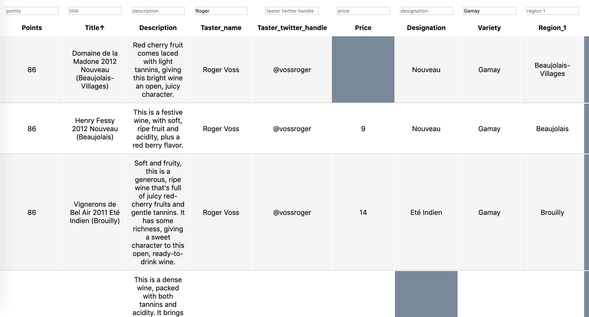

# dom-backend
Render a Table using dom scripting, add sorting & filtering functionality



## Pushing app to heroku

  - Create an account on heroku.
  - Get access credentials and create an app.
  - Copy the ssh git location 
  - In your local m/c, in the project root, run the following command
      - In case you don't have the heroku cli installed, do this
          - https://devcenter.heroku.com/articles/heroku-cli
          - `heroku --version` to check version
          - `heroku login` to check if the heroku login works 
  - Make the following changes in your package.json
```json
{
  "name": "backend",
  "version": "0.0.0",
  "private": true,
  "main": "app.js",
  "scripts": {
    "start": "node ./bin/www",
    "devstart": "nodemon ./bin/www"
  },
  "engines": {
    "node": "10.x"
  },
  "dependencies": {
    "cookie-parser": "~1.4.4",
    "debug": "~2.6.9",
    "express": "~4.16.1",
    "http-errors": "~1.6.3",
    "jade": "~1.11.0",
    "morgan": "~1.9.1"
  },
  "devDependencies": {
    "nodemon": "^2.0.2"
  }
}
```
  - Create a file `Procfile` in root with the following statement: `web: ./bin/www npm start`
  - Initialize the git repository and make a commit.
  - `git init &&  git add . && git commit -m 'first draft'`
  - `git remote add heroku <ssh url>`
  - `git push heroku master`
  